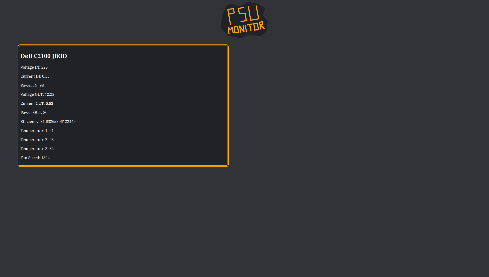

A personal and basic project consisting of: 
- website made using Django to show power supply information
- 2 esp8266s comunicating between each other using ESPNOW, one is connected to the website host and the other to a PSU using PMBUS

The point of this project was to give me a way to display the data the PSU was outputing via PMBUS and it was done in ~1 week.

Here is how it looks deployed in my homelab:

Credits: 
The code for implementing PMBUS on Arduino or related devices: https://github.com/sxjack/dps750tb_psu_i2c
